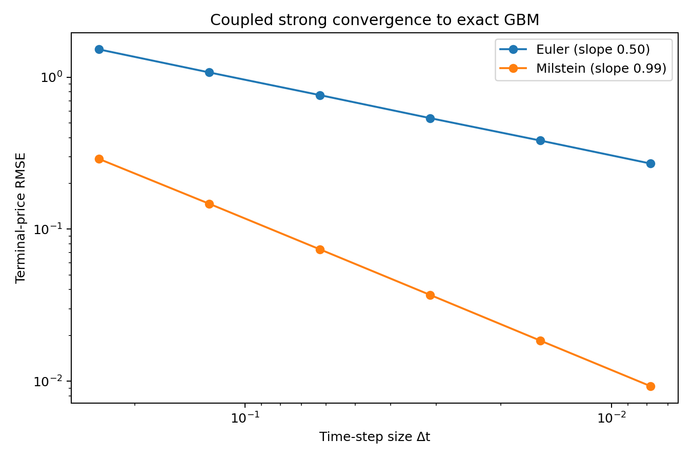
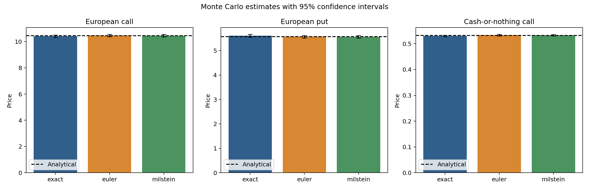
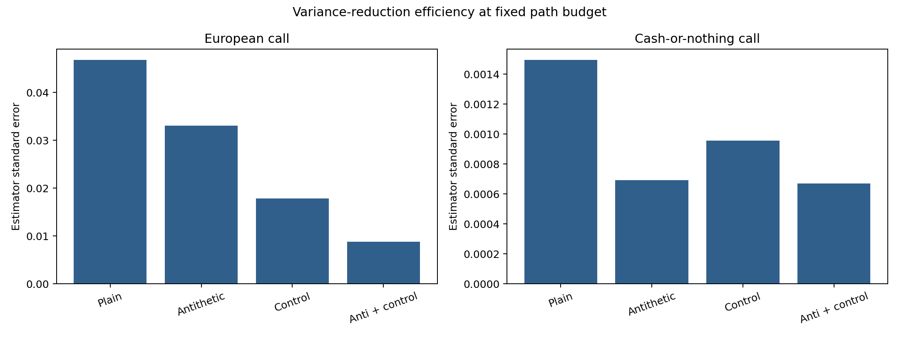
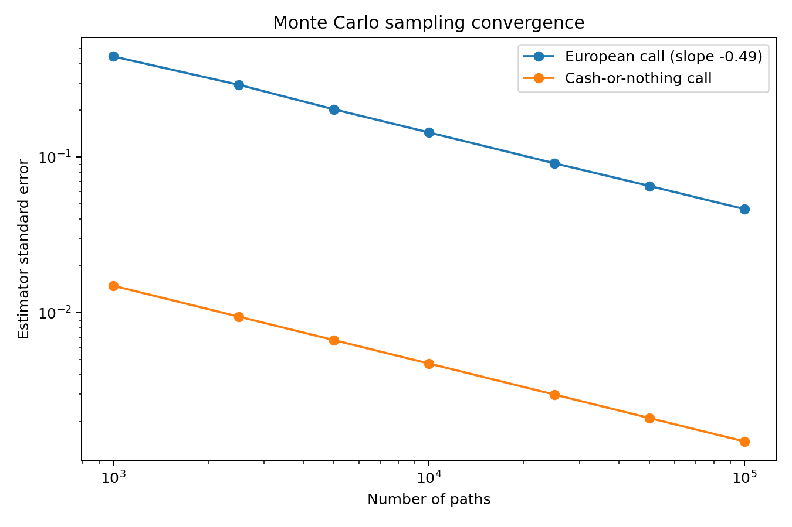
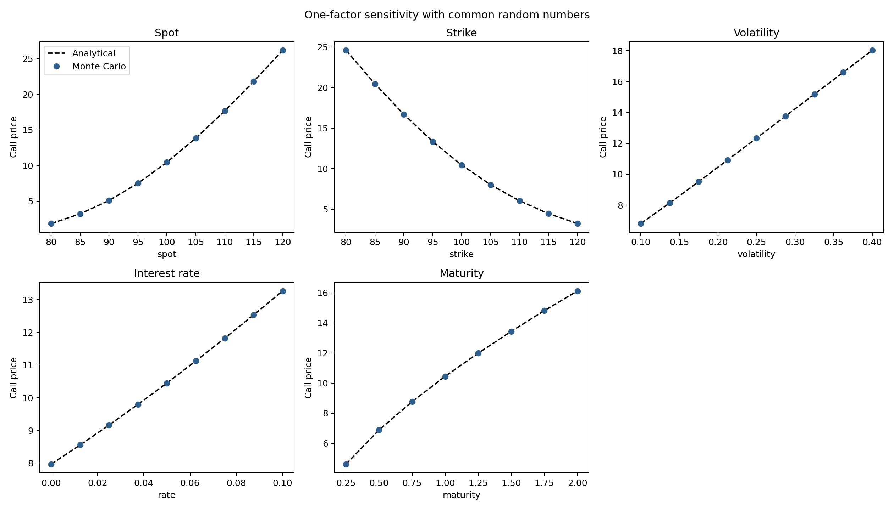

# Monte Carlo Derivatives Pricing

[](https://github.com/farmanshamsi/monte-carlo-derivatives-pricing/actions/workflows/ci.yml)
[](https://www.python.org/)
[](LICENSE)

A reproducible numerical-finance project for pricing European vanilla and
cash-or-nothing options under risk-neutral geometric Brownian motion. The
engine compares exact terminal simulation, Euler–Maruyama, and Milstein against
Black–Scholes benchmarks; measures variance-reduction efficiency; estimates
strong convergence orders; and validates pathwise Greeks.

The repository is structured as a tested Python package rather than a static
report. Every result below is regenerated by the command-line pipeline with a
fixed seed.

## Verified highlights

The committed study uses 100,000 paths, 100 time steps, and seed 42 with
\(S_0=K=100\), \(T=1\), \(r=5\%\), and \(\sigma=20\%\).

| Result | Measured value | Theoretical reference |
|---|---:|---:|
| European-call SE reduction, antithetic + control | **81.2%** | Lower is better |
| Binary-call SE reduction, antithetic + control | **55.1%** | Lower is better |
| Euler strong-convergence order | **0.498** | 0.5 |
| Milstein strong-convergence order | **0.994** | 1.0 |
| Monte Carlo SE scaling exponent | **−0.493** | −0.5 |
| Largest Greek benchmark deviation | **2.03 SE** | Within 95%–99.7% sampling range |

These are useful numerical results because they test different failure modes:
sampling error, discretization error, estimator efficiency, and sensitivity
accuracy.



## Benchmark pricing

Black–Scholes values are treated as external numerical benchmarks rather than
as inputs to the Monte Carlo estimator.

| Contract | Analytical | Exact GBM MC | Euler MC | Milstein MC |
|---|---:|---:|---:|---:|
| European call | 10.450584 | 10.420541 | 10.461072 | 10.457145 |
| European put | 5.573526 | 5.612204 | 5.570989 | 5.568109 |
| Cash-or-nothing call | 0.532325 | 0.530310 | 0.533364 | 0.532831 |

All nine baseline estimates fall within two estimator standard errors of their
analytical benchmarks. At 100 time steps, the Milstein call estimate is within
0.0066 price units of Black–Scholes; this individual error should be read
together with the confidence interval, not as evidence that one random draw is
universally superior.



## Variance reduction

The control variate is discounted terminal stock value,
\(e^{-rT}S_T\), whose expectation under the pricing measure is known:
\(\mathbb{E}[e^{-rT}S_T]=S_0e^{-qT}\). The implementation estimates the
optimal sample coefficient and can combine it with antithetic pairing.

| Contract | Plain SE | Antithetic | Control | Antithetic + control |
|---|---:|---:|---:|---:|
| European call | 0.046770 | 0.033077 | 0.017875 | **0.008798** |
| Cash-or-nothing call | 0.001494 | 0.000694 | 0.000956 | **0.000671** |

The smoother vanilla payoff benefits strongly from the stock control variate.
The discontinuous binary payoff benefits more from antithetic pairing, which is
consistent with its weaker linear relationship to terminal stock value.



## Discretization study

Euler and Milstein are coupled to the same fine Brownian paths. Coarser
increments are formed by aggregating the fine increments, and terminal RMSE is
measured against the exact GBM solution on those same paths. This isolates
discretization error from ordinary Monte Carlo noise.

Across step sizes from \(1/4\) to \(1/128\):

- Euler terminal RMSE falls from 1.5237 to 0.2703.
- Milstein terminal RMSE falls from 0.2897 to 0.0093.
- Log–log slopes are 0.498 and 0.994, matching the expected strong orders of
  \(1/2\) and \(1\).

The separate path-count experiment produces a standard-error slope of −0.493,
close to the Monte Carlo rate \(O(N^{-1/2})\).



## Greeks

Delta, Vega, and Rho are estimated with pathwise payoff derivatives under exact
GBM and compared with analytical Black–Scholes Greeks.

| Greek | Monte Carlo | Analytical | Standard error | Difference in SE units |
|---|---:|---:|---:|---:|
| Delta | 0.640086 | 0.636831 | 0.001824 | 1.78 |
| Vega | 38.013125 | 37.524035 | 0.241525 | 2.03 |
| Rho | 53.460045 | 53.232482 | 0.149242 | 1.52 |

## Sensitivity analysis

One-factor-at-a-time scenarios cover spot, strike, volatility, interest rate,
and maturity. Every scenario uses the same random seed, so differences across a
grid are driven primarily by the parameter change rather than unrelated
simulation noise.



## Methodological correction from the original study

The original CQF exam implementation reused one Gaussian shock throughout each
Euler path because it followed an exam-specific convention. That does not
construct standard Brownian motion and can give misleading convergence
behavior.

This public implementation corrects the issue:

```text
dW[t, path] ~ Normal(0, Δt), independently for every time step and path
```

Antithetic paths use `+dW` and `−dW`; convergence experiments reuse coupled
increments intentionally and explicitly.

## Package design

```text
.
├── .github/workflows/ci.yml
├── notebooks/research_walkthrough.ipynb
├── outputs/
├── src/monte_carlo_pricing/
│   ├── analytical.py
│   ├── contracts.py
│   ├── experiments.py
│   ├── greeks.py
│   └── simulation.py
├── tests/
├── pyproject.toml
└── README.md
```

Core features:

- immutable market and payoff definitions;
- exact GBM, memory-efficient Euler, and memory-efficient Milstein simulation;
- European calls, puts, and cash-or-nothing calls;
- analytical prices and call Greeks;
- 95% Monte Carlo confidence intervals;
- antithetic, control-variate, and combined estimators;
- deterministic seeds and explicit independent-sample accounting;
- coupled discretization experiments and common-random-number sensitivities;
- CLI artifact generation, tests, and multi-version GitHub Actions CI.

## Installation and reproduction

Python 3.10–3.13 is supported.

```bash
python -m venv .venv
source .venv/bin/activate
python -m pip install -e ".[dev]"
python -m monte_carlo_pricing --paths 100000 --steps 100 --seed 42
pytest
```

The command regenerates:

- `baseline_pricing.csv`
- `variance_reduction.csv`
- `discretization_convergence.csv`
- `path_convergence.csv`
- `sensitivity_analysis.csv`
- `call_greeks.csv`
- `run_summary.json`
- five publication-ready PNG figures

## Python API

```python
from monte_carlo_pricing import EuropeanCall, Market, price_option

market = Market(spot=100, rate=0.05, volatility=0.20)
call = EuropeanCall(strike=100, maturity=1.0)

estimate = price_option(
    call,
    market,
    paths=100_000,
    method="exact",
    variance_reduction="antithetic_control",
    seed=42,
)

print(estimate.price, estimate.standard_error)
```

## Validation

The test suite covers:

- published Black–Scholes reference values;
- put–call parity;
- Monte Carlo benchmark agreement in standard-error units;
- fixed-seed reproducibility;
- measured variance-reduction improvement;
- Milstein versus Euler coupled terminal error;
- pathwise Greek agreement;
- invalid-input handling.

CI runs linting, tests, and a command-line smoke study on Python 3.10, 3.12,
and 3.13.

## Limitations

- GBM assumes constant volatility and continuous paths.
- The project prices European terminal-payoff contracts only.
- It does not calibrate to an implied-volatility surface.
- Transaction costs, hedging error, jumps, stochastic volatility, and model
  risk are outside the present scope.
- Reproduced numerical agreement validates the implementation under its stated
  model; it does not validate GBM as a complete description of markets.

## Background and references

The project began as CQF Monte Carlo coursework and was refactored for public
portfolio use with permission. Assessment declarations and course-only
materials are excluded.

Methodological references include Glasserman's *Monte Carlo Methods in
Financial Engineering*, Jäckel's *Monte Carlo Methods in Finance*, and Kloeden
and Platen's *Numerical Solution of Stochastic Differential Equations*.

## License

MIT License. See [LICENSE](LICENSE).
